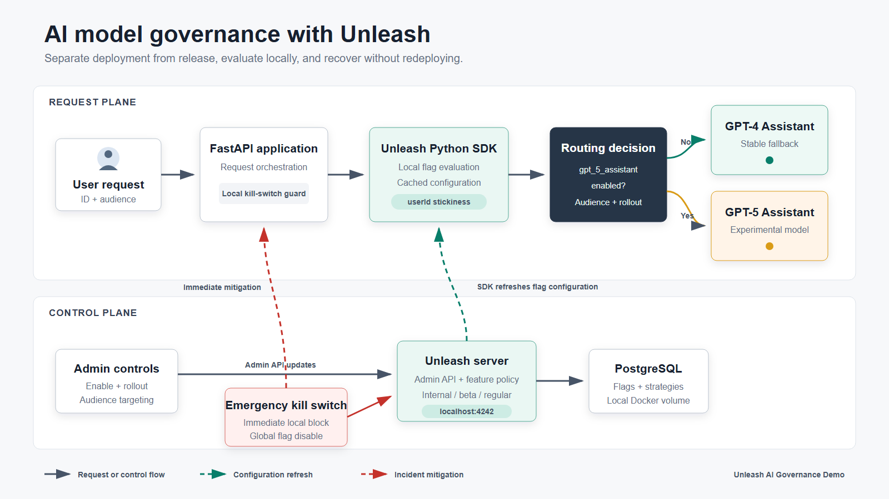
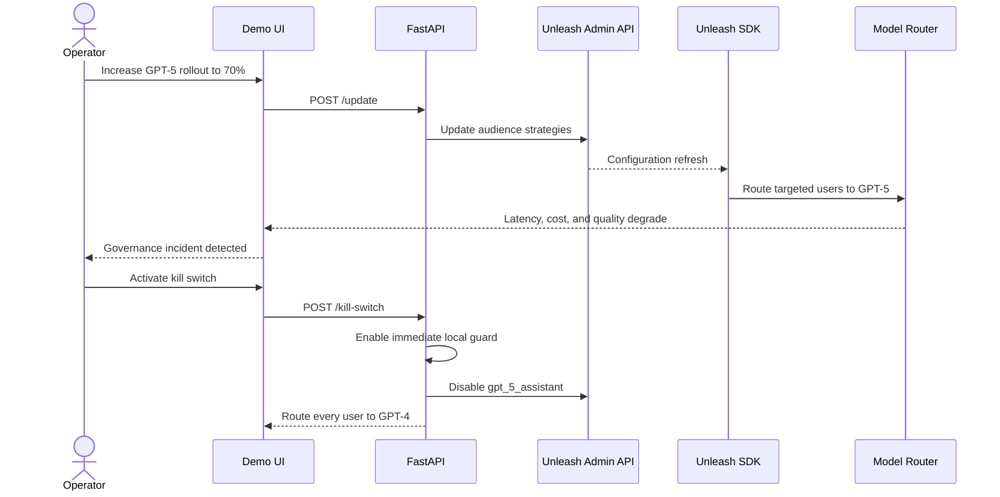

<div align="center">

# Unleash AI Governance Demo

### Ship GPT-5 gradually. Watch production signals. Recover instantly.

[](https://www.python.org/)
[](https://fastapi.tiangolo.com/)
[](https://docs.getunleash.io/)
[](https://docs.docker.com/compose/)

A production-incident simulation showing how feature management can govern an experimental AI model without coupling release decisions to deployments.

</div>

---

## The Problem

An enterprise assistant already runs reliably on **GPT-4**. The team wants to introduce **GPT-5**, but a global release creates three immediate risks:

- response latency may increase;
- cost per request may become unsustainable;
- hallucination rates may exceed governance thresholds.

Deploying the model is a technical action. Deciding **who receives it, how quickly exposure grows, and how to recover** is a release-management problem.

This demo places GPT-5 behind the `gpt_5_assistant` Unleash flag. The application can deploy once, release progressively, and return every user to GPT-4 without rebuilding or redeploying.

## What The Demo Proves

- **Gradual rollout:** increase GPT-5 exposure from a controlled canary to broader production traffic.
- **Audience targeting:** release to internal employees, beta users, and regular users in stages.
- **Sticky assignment:** the same `userId` receives a consistent model decision.
- **Operational visibility:** observe simulated latency, request cost, and hallucination rate.
- **Incident response:** activate a local guard immediately and disable the flag globally through the Unleash Admin API.
- **Resilient startup:** fall back safely when Unleash is unavailable and reconnect when it becomes healthy.

## High-Level Design

<p align="center">
  
</p>

The architecture has two distinct paths:

1. **Request plane:** FastAPI passes `userId` and `userType` to the Unleash Python SDK. The SDK evaluates its locally cached configuration and selects GPT-4 or GPT-5.
2. **Control plane:** the demo controls update feature state, rollout strategies, and targeting constraints through the Unleash Admin API.

During an incident, the kill switch blocks GPT-5 in the application immediately while also disabling the flag in Unleash so every SDK client converges on the safe state.

## Model Decision

```python
client.is_enabled(
    "gpt_5_assistant",
    {
        "userId": user_id,
        "properties": {"userType": user_type},
    },
)
```

The SDK evaluates flags locally rather than adding a network request to every model decision. `userId` provides deterministic stickiness; `userType` enables audience constraints.

## Rollout Policy

| Slider | Internal employees | Beta users | Regular users |
|---:|---:|---:|---:|
| 0% | GPT-4 | GPT-4 | GPT-4 |
| 10% | 100% GPT-5 | 10% GPT-5 | GPT-4 |
| 50% | 100% GPT-5 | 50% GPT-5 | GPT-4 |
| 70% | 100% GPT-5 | 70% GPT-5 | 40% GPT-5 |
| 100% | 100% GPT-5 | 100% GPT-5 | 100% GPT-5 |

This mirrors a realistic release sequence: employees first, beta customers second, and regular customers last.

## Incident Sequence



## What Is Real And What Is Simulated

| Real integration | Simulated for the scenario |
|---|---|
| Local Unleash server | GPT-4 and GPT-5 inference |
| Official Unleash Python SDK | Model response latency |
| Unleash Admin API | Cost per request |
| Percentage rollout | Hallucination events |
| Audience constraints | Production traffic |
| Deterministic assignment | Incident telemetry |
| Global flag disablement | |

The simulation is intentionally transparent: Unleash controls real routing decisions, while deterministic demo telemetry makes the incident reproducible on camera.

## Production Story

1. GPT-5 is deployed but disabled. Every user receives the stable GPT-4 assistant.
2. The team enables a 10% canary for internal and beta evaluation.
3. Metrics look acceptable, so the rollout expands beyond 50%.
4. Latency, cost, and hallucination signals breach governance thresholds.
5. The operator activates the emergency kill switch.
6. Every request returns to GPT-4 immediately, without a new deployment.

## Quick Start

### Prerequisites

- Python 3.11+
- Docker Desktop with Docker Compose

### 1. Clone and install

```powershell
git clone https://github.com/mehra-deepak/unleash-ai-governance-demo.git
cd unleash-ai-governance-demo
python -m venv .venv
.venv\Scripts\python.exe -m pip install -r requirements.txt
```

### 2. Start Unleash and PostgreSQL

```powershell
docker compose up -d
docker compose ps
```

Open the Unleash dashboard at [http://localhost:4242](http://localhost:4242).

Local credentials:

```text
Username: admin
Password: unleash4all
```

### 3. Start the application

```powershell
.venv\Scripts\python.exe -m uvicorn app:app --reload
```

Open [http://localhost:8000](http://localhost:8000).

The frontend is served by FastAPI, so no separate frontend process is required.

## Suggested Demo Flow

1. Begin at 0% and show GPT-4 serving every audience.
2. Enable GPT-5 at 10% and route an internal employee.
3. Route a regular user and show that GPT-4 still protects them.
4. Simulate 50 AI requests and inspect the initial metrics.
5. Increase rollout to 70% and simulate traffic again.
6. Observe the red incident state and degraded telemetry.
7. Activate the emergency kill switch and confirm immediate GPT-4 recovery.

## Resilience And Safety

If Unleash is unavailable during startup, the application retries briefly and then fails closed:

```text
Unleash not connected - running in demo mode
```

Model checks remain on GPT-4 until Unleash becomes healthy. The SDK continues refreshing configuration in the background.

The repository contains predictable **local-development tokens** for a one-command demo. They are not production secrets and must never be reused for an internet-accessible Unleash deployment.

## Project Structure

```text
unleash-ai-governance-demo/
|-- app.py                 # FastAPI routes and application lifecycle
|-- flag_engine.py         # SDK evaluation, Admin API, metrics, kill switch
|-- docker-compose.yml     # Local Unleash and PostgreSQL
|-- requirements.txt
|-- assets/
|   |-- unleash-ai-governance-hld.png
|   `-- unleash-ai-governance-hld.svg
|-- templates/
|   `-- index.html
`-- static/
    `-- script.js
```

## API

| Method | Endpoint | Purpose |
|---|---|---|
| `GET` | `/check?user_id=user-007&user_type=regular` | Evaluate one user |
| `POST` | `/simulate?count=50` | Simulate AI traffic |
| `POST` | `/update?enabled=true&rollout=50` | Update rollout policy |
| `POST` | `/kill-switch` | Disable GPT-5 immediately |
| `GET` | `/logs` | Read recent evaluations |
| `GET` | `/config` | Read demo configuration |
| `GET` | `/diagnostics` | Check Unleash connectivity |

## Environment Variables

| Variable | Local default | Purpose |
|---|---|---|
| `UNLEASH_URL` | `http://localhost:4242/api` | Unleash SDK API URL |
| `UNLEASH_API_TOKEN` | local demo token | Backend SDK authentication |
| `UNLEASH_ADMIN_TOKEN` | local demo token | Admin API authentication |
| `UNLEASH_APP_NAME` | `ai-governance-demo` | SDK application identity |
| `UNLEASH_PROJECT_ID` | `default` | Unleash project |
| `UNLEASH_ENVIRONMENT` | `development` | Target environment |
| `UNLEASH_STARTUP_RETRIES` | `5` | Startup health attempts |
| `UNLEASH_RETRY_DELAY` | `0.5` | Delay between attempts |

## Troubleshooting

Check the local services:

```powershell
docker compose ps
Invoke-RestMethod http://localhost:4242/health
```

If Unleash is healthy but users remain on GPT-4, click **Update Model Rollout** and wait approximately two seconds for the SDK refresh.

---

<div align="center">

**Deploy the model. Control the exposure. Keep the fallback boring.**

</div>
